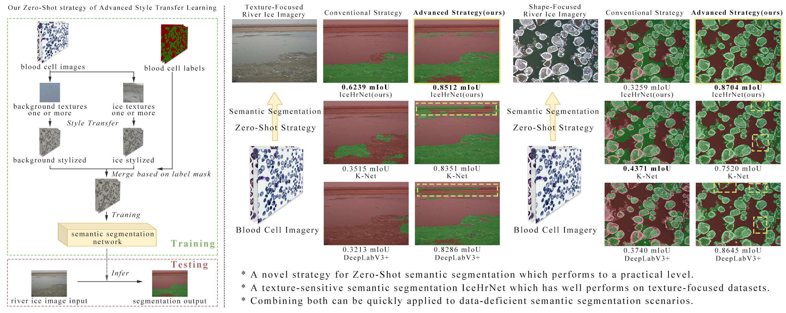

# IceHrNet
IceHrNet-IceSegmentation 
A high resolution semantic segmentaion networkfor river ice segmentation  

The code and models will be released here...

## 1 Summary
IceHrNet is a Texture-Sensitive Semantic Segmentation method for Zero-Shot transfer learning.

This code contains:
1. dataset(train set: blood cell images stylized by river ice; test set: river ice iamges)
2. train.py/evaluate.py/predict.py
3. PaddleSeg framework (include IceHrNet network, model file: "IceHrNet/PaddleSeg/paddleseg/models/icehrnet.py"; backbone file:"IceHrNet/PaddleSeg/paddleseg/models/backbones/icehrnet_backbone.py")

<div align="center">
  
</div>

## 2 Installation

### 2.1 Environment Requirements
- OS: 64-bit
- Python 3(3.6/3.7/3.8/3.9/3.10)，64-bit version
- pip/pip3(9.0.1+)，64-bit version
- CUDA >= 10.2
- cuDNN >= 7.6
- PaddlePaddle (the version >= 2.4)

### 2.2 Install PaddlePaddle

you might need Conda:
```
conda create -n env_icehrnet python=3.8

conda activate env_paddleseg

conda install cudatoolkit=11.7.0 -c conda-forge

conda install cudnn=8.4.1.50 -c conda-forge 
```


Highly recommend you install the GPU version of PaddlePaddle, due to the large overhead of segmentation models, otherwise, it could be out of memory while running the models.

For example, run the following command to install Paddle with Conda, CUDA 11.7.0

```
conda install paddlepaddle-gpu==2.5.1 -c https://mirrors.tuna.tsinghua.edu.cn/anaconda/cloud/Paddle/
```


In Python interpreter, run the following command to confirm whether PaddlePaddle is installed successfully

```
>>> import paddle
>>> paddle.utils.run_check()

# If the following prompt appears on the command line, the PaddlePaddle installation is successful.
# PaddlePaddle is installed successfully! Let's start deep learning with PaddlePaddle now.

# Confirm PaddlePaddle version
>>> print(paddle.__version__)

```

### 2.3 Get IceHrNet

Clone the IceHrNet repo from Github

```
git clone https://github.com/PL23K/IceHrNet.git
```

### 2.4 Install PaddleSeg

Run the following command, install PaddleSeg from source. If you make modification to `PaddleSeg/paddleseg`, it will be efficient without reinstallation.

```
cd IceHrNet/PaddleSeg
pip install -r requirements.txt
pip install -v -e .
```

### 2.5 Verify Installation
In the root of PaddleSeg, run the following command.
If there are no error in terminal log, you can use PaddleSeg to train, validate, test and export models with config method.

```
cd IceHrNet/PaddleSeg
sh tests/install/check_predict.sh
```

## 3 Usage

### 3.1 Pretrained

1. "Fixed Camera River Ice" model (trained by stylized Blood Cell dataset, 0.8512 mIoU). [Here](./src/Transfer/FixedCamera_2_BloodCell_Advanced/output/20230915065614/best_model/README.md).
2. "UAV River Ice" model (trained by stylized Blood Cell dataset, 0.8704 mIoU). [Here](./src/Transfer/UAV_2_BloodCell_Advanced/output/20230915070734/best_model/README.md).

### 3.2 Predict

```
cd IceHrNet/src/Transfer/FixedCamera_2_BloodCell_Advanced
python predict.py

or

cd IceHrNet/src/Transfer/UAV_2_BloodCell_Advanced
python predict.py
```

### 3.3 Train

```
cd IceHrNet/src/Transfer/FixedCamera_2_BloodCell_Advanced
python train.py

or

cd IceHrNet/src/Transfer/UAV_2_BloodCell_Advanced
python train.py
```

### 3.4 Evaluate

```
cd IceHrNet/src/Transfer/FixedCamera_2_BloodCell_Advanced
python evaluate.py

or

cd IceHrNet/src/Transfer/UAV_2_BloodCell_Advanced
python evaluate.py
```

## 4 Citation
If you find our project useful in your research, please consider citing:

```latex
@misc{IcehrnetAndASTL2023,
      title={An easy zero-shot learning combination: Texture Sensitive Semantic Segmentation IceHrNet and Advanced Style Transfer Learning Strategy},
      author={Zhiyong Yang and Yuelong Zhu and Xiaoqin Zeng and Jun Zong and Xiuheng Liu and Ran Tao and Xiaofei Cong and Yufeng Yu},
      year={2023},
      eprint={2309.06175},
      archivePrefix={arXiv},
      primaryClass={cs.CV}
}

@misc{icehrnet2023,
    title={IceHrNet, Texture-Sensitive Semantic Segmentation method for Zero-Shot transfer learning},
    author={Zhiyong Yang},
    howpublished = {\url{https://github.com/PL23K/IceHrNet}},
    year={2023}
}